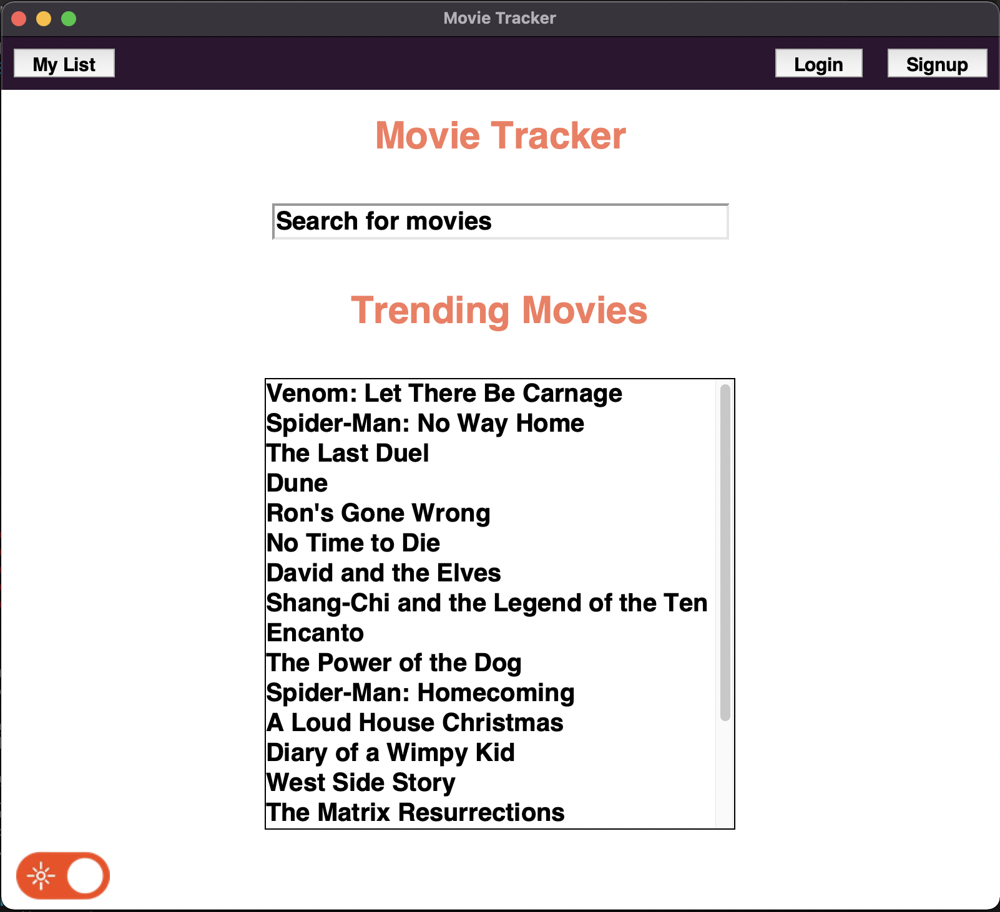
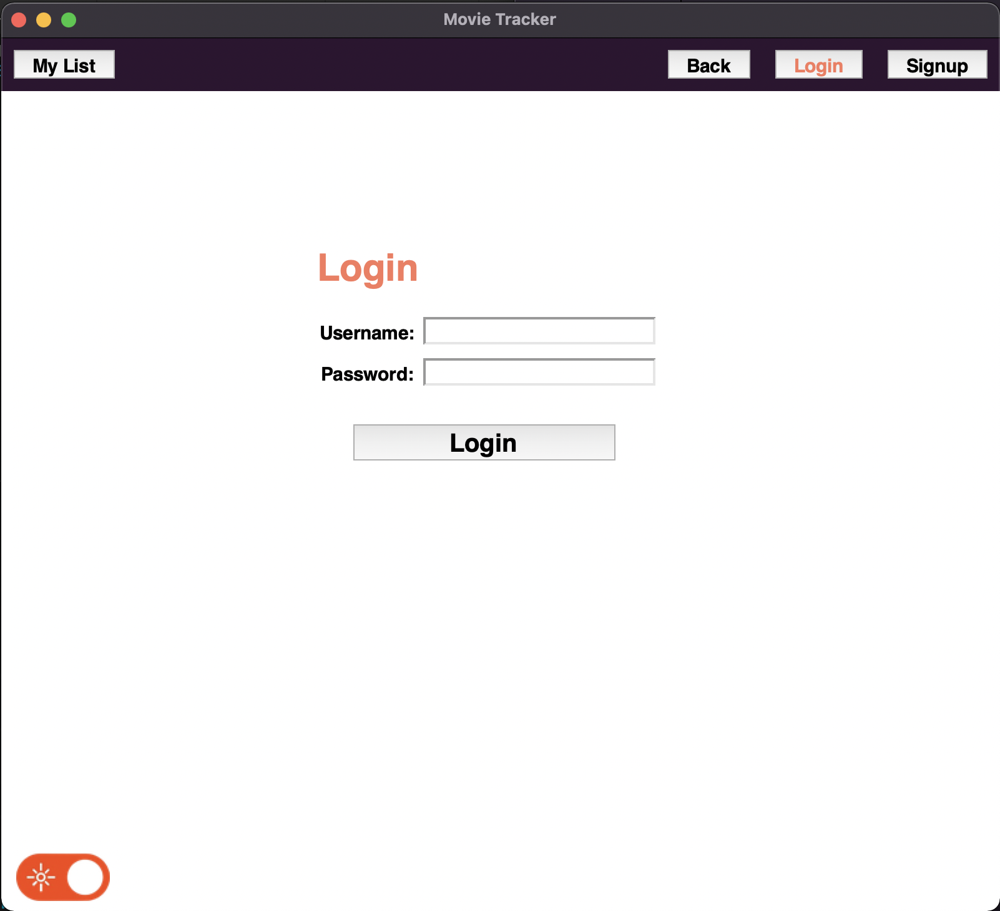
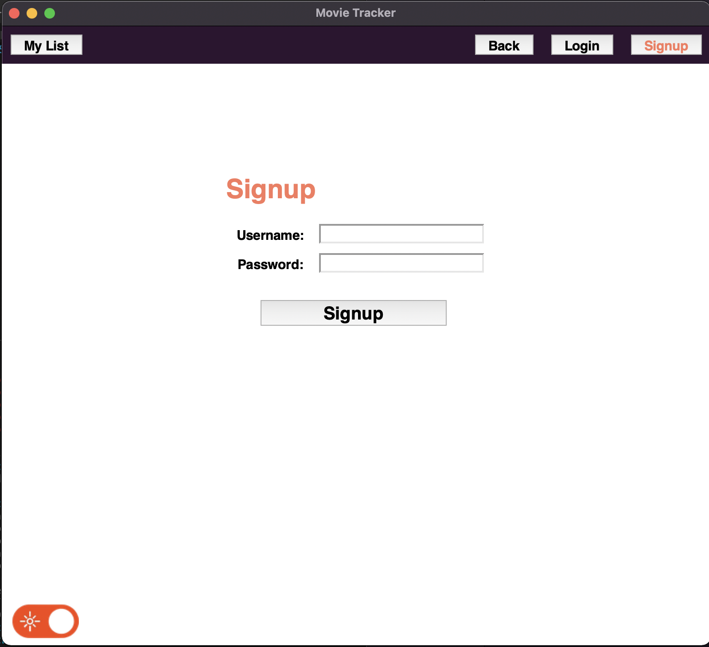
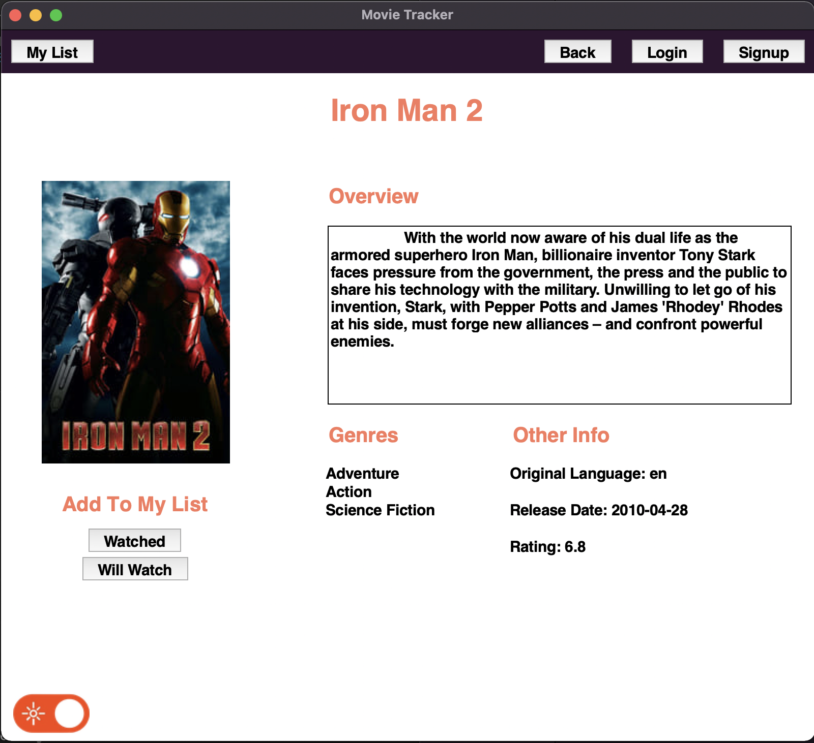
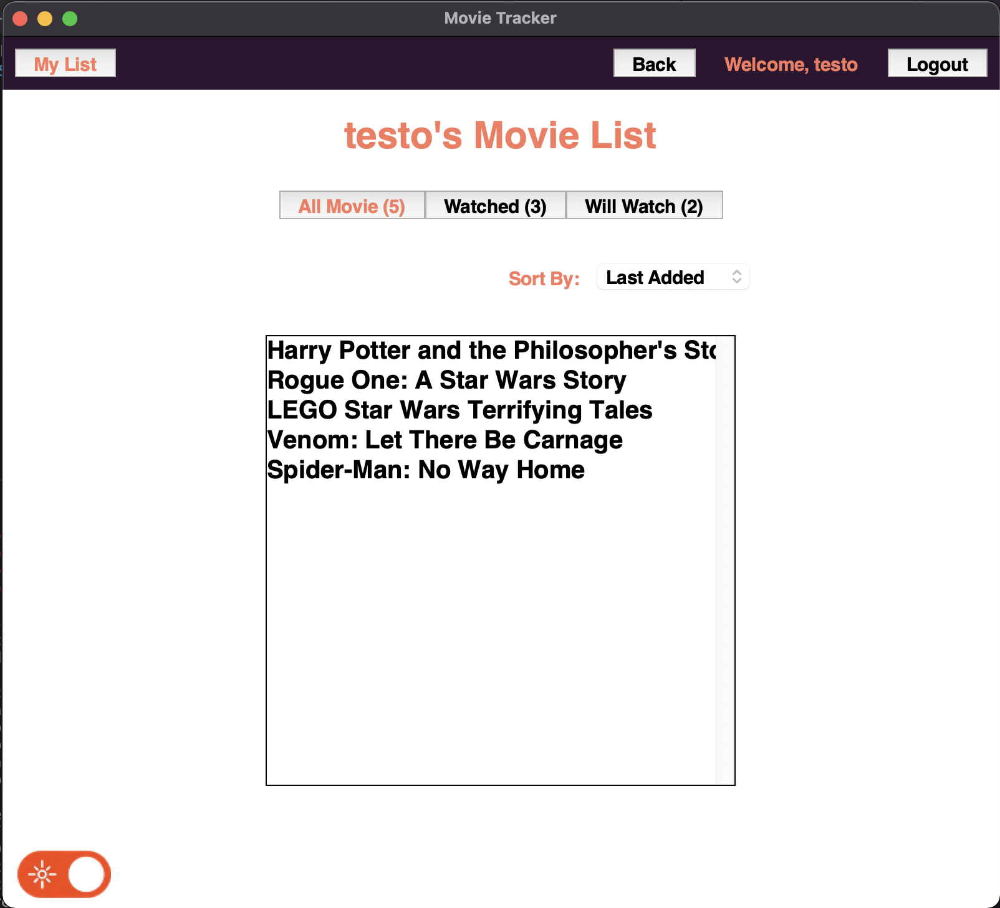
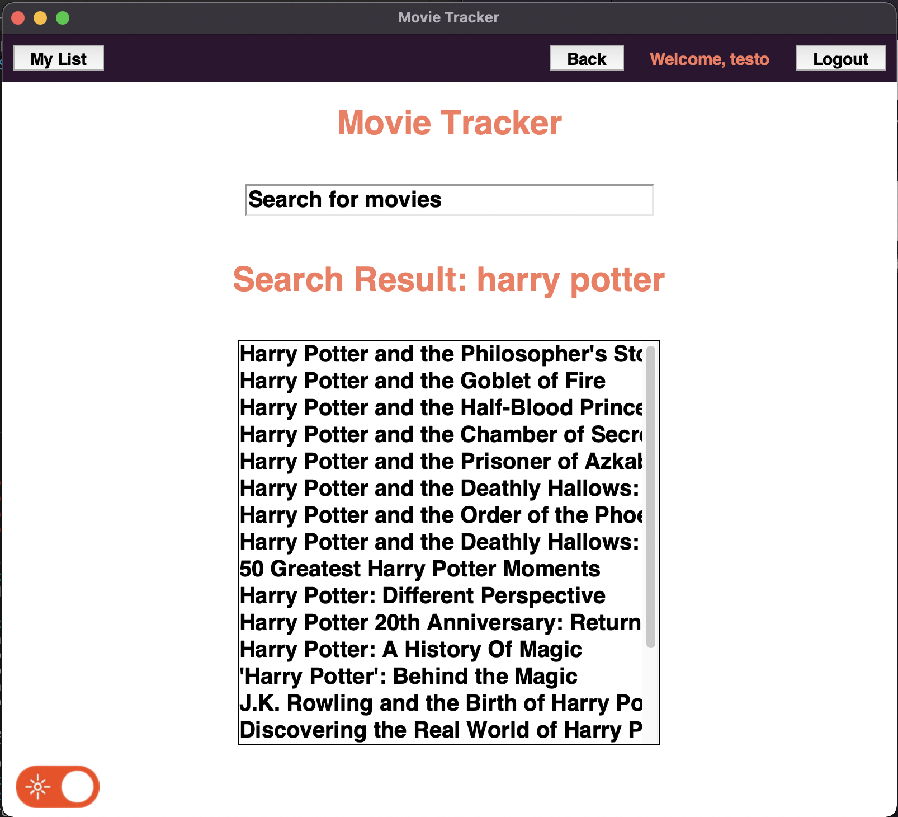
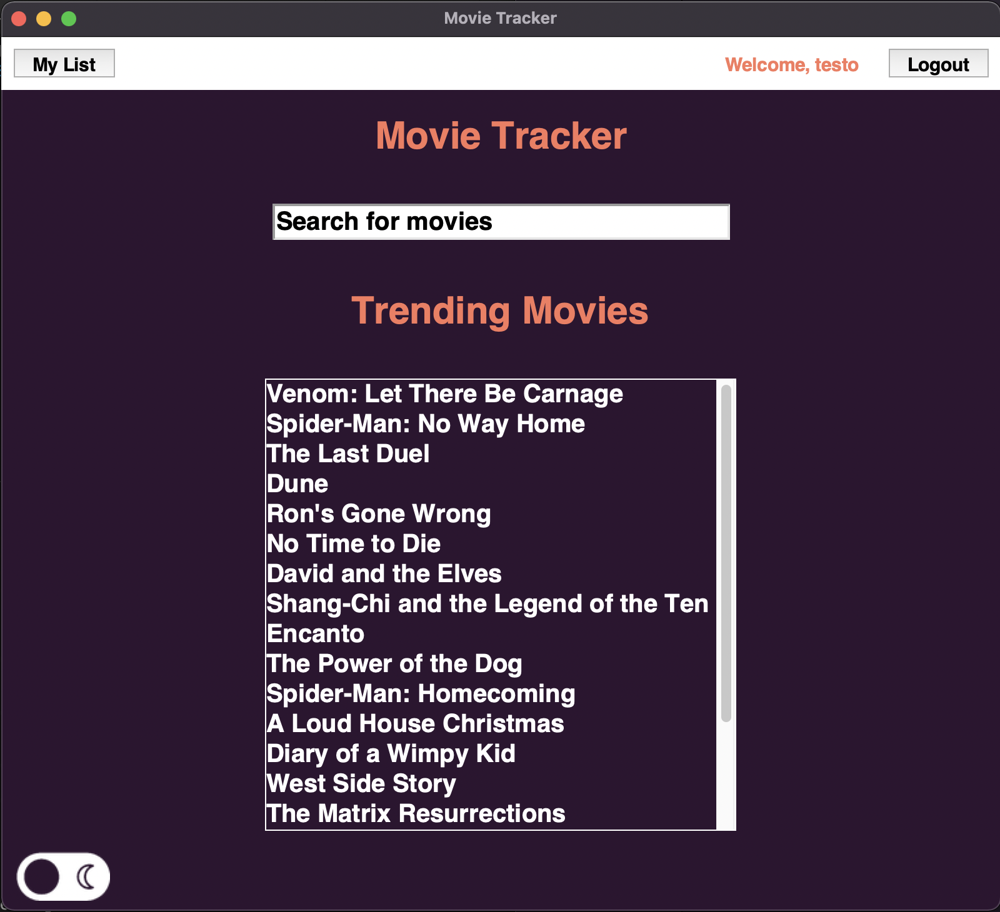

# Movie Tracker

A GUI program built using tkinter. Allows user to conveniently keep track of the movies they've watched.

KMITL's Introduction To Computers And Programming project by Mahnun Saratunti (64011456)

All data related to movies are provided by [The Movie Database (TMDb) API](https://developers.themoviedb.org/3)

## Install

```
git clone https://github.com/kaikaewkmitl/movie-tracker.git
cd movie-tracker
pip install -r requirements.txt
python3 main.py
```

## Features

* Displays a list of trending movies on the program’s Main Page.
* Users can search for a specific movies via search bar.
* All information related to movie is fetched from TMDb API.
* Users can view information of a specific movie. The movie's information includes:
  * movie's overview
  * poster
  * genres
  * rating
  * release date
  * etc.
* Basic user authentication. Users' data are stored in Heroku Postgres (SQL database managed by Heroku).
* The users' password are encrypted using Python's bcrypt library.
* After login, users have a freedom the add movies to their 'watech list' or 'will-watch list'.
* Users can view thier list on User List Page, they can view all movies, or filter down to just 'watched list' or 'will-watch list'.
* Users can also sort their list by movies' name, rating.
* Toggle between dark and light theme.

## Previews

Main Page



Login Page



Signup Page



Movie Information Page



User's Movie List Page



Searching For Movies



Enable Dark Theme



## Credits

<a href="https://developers.themoviedb.org/3">

</a>
